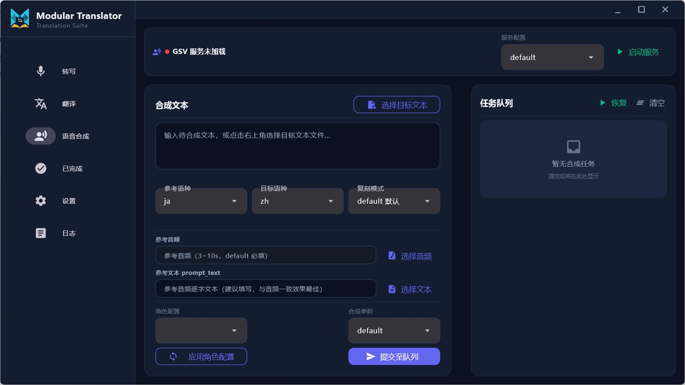

# Modular Translator — 模块化翻译器

面向 Windows 的 Flet 翻译工作台：音频转写 / 翻译 / 语音合成，全流程可本地运行（也可用云端 API 翻译）。



所有配置集中在 `app_light/configs/`，界面「设置」页提供基于 schema 的配置表单；本文档以下按「翻译 → 转写 → 语音合成」三块说明各参数含义。

---

## 一、翻译管线与规则（rule）用法

### 翻译管线

```
源文本 → 规则分割 splitter.split(text)（按行 → 每行按结构段拆解）
      → 提取可译段 + 贪心组块（token / 行数上限）
      → 渲染提示词模板（system + user，含按块过滤后的术语表）
      → LLM 流式翻译（每块一次请求，按行对齐）
      → 回填（行数不匹配先逐句重译对齐，仍失败用原文补齐）
      → splitter.merge() 还原前缀/后缀结构与占位符 → 输出
```

- **分割**：`split(text)` 一次处理全文——外层按 `\n` 分行，内层对每行做 token 扫描，产出 `[prefix][body][suffix]` 结构段（纯正文段为 `[body]`，一行可含多个段；空行原样保留）。
- **占位符保护**：`placeholder` 命中的标记在分割阶段即从正文 `body` 中替换为唯一标记——单次匹配用替换文本（如 `<<<PH>>>`），多次匹配用 `<<<PH>>>#0、#1…`；翻译后由 `merge()` 逐一原样还原，防止模型改动不可变内容（仅作用于 `body`，不作用于 `prefix`/`suffix`）。
- **组块**：可译段正文按行拼接后贪心打包。Llama 后端上限 = `上下文长度(-c) × max_token_ratio`，且每块实际 token 数经 llama-server `/tokenize` 接口实测（失败则视为无 token 限制），另按 `max_lines` 限制块内行数；**API 后端不设上限**——整段可译文本一次性发送。
- **回填对齐**：合并阶段按可译段序号逐行回填译文（空行/跳过行/纯空白占位不消耗译文行）；译文行数不匹配时先**逐句重译**保证一对一，仍失败才在合并阶段用原文补齐。
- **术语表**：仅把「`src` 出现在当前块文本内」的词条渲染进该块的 user 模板（`{GLOSSARY_TEXT}`）；未选择规则时使用空的分割器，分割→组块→回填流程保持一致。
- **拆句**：仅**纯正文段**按句末标点（`。！？!?`）拆句，括号/引号内的标点不参与；结构段整体不拆句，其正文首尾空白并入 `prefix`/`suffix`，避免翻译丢失空格。

### rule JSON 结构

每个规则文件是一个 JSON，可选以下 5 个键（均为数组）：

| 键 | 含义 |
|---|---|
| `prefix` | 前缀结构条目列表：识别行内的起始结构标记（token 扫描按任意位置匹配，非仅行首） |
| `suffix` | 后缀结构条目列表：识别行内的结束结构标记（同，非仅行尾） |
| `placeholder` | 二维数组 `[[匹配条目, 替换文本], ...]`：保护不可变标记 |
| `skip` | 可选：命中的行**整体不翻译**、原样透传（优先级最高） |
| `recognize` | 可选：过滤器。未配置 = 所有行都翻译；配置后 = 只有匹配的行才翻译，其余整行透传 |

**条目格式**（`prefix`/`suffix`/`skip`/`recognize` 的元素）：

| 形式 | 含义 |
|---|---|
| `"「"` | 字面量：与源文本精确匹配（内部自动 re.escape，特殊字符无需转义） |
| `{"literal": "…"}` | 字面量（与字符串等价） |
| `{"regex": "…"}` | 正则表达式 |

**匹配语义**：`prefix` 与 `suffix` 在行内**独立识别、无需配对**；token 级扫描（正则锚定当前位置，**最长匹配优先**，同长时前缀优先），其余文本为正文 `body`；连续多个前缀聚合为一个结构段的 prefix 槽、连续后缀聚合为 suffix 槽——**结构段**聚合形态恒为 `[prefix][body][suffix]`，**纯正文段**为 `[body]`，一行可产出多个段。仅纯正文段按句末标点（`。！？!?`）拆句，括号/引号内的标点不参与；结构段不拆句。零宽匹配的规则（如 `{"regex": "$"}`）在 v2 扫描中不产生 token，实际无效。

### 内置示例

**`configs/translate/rules/jp_noval.json`**（日文小说）——识别日文引用/括号标记：

```json
{
    "description": "日文小说用规则 — 识别日文引用/括号标记",
    "prefix": ["「", "『", "（", "【", "《", "〈", "“", "‘", "\u3000"],
    "suffix": ["」", "』", "）", "】", "》", "〉", "“", "‘", "\u3000"],
    "placeholder": [
        [{"regex": "<<<[^>]*>>>"}, "<<<PH>>>"]
    ]
}
```

**`configs/translate/rules/lrc.json`**（标准 LRC 歌词）——识别时间戳与说话人标签：

```json
{
    "description": "标准 LRC 歌词规则…",
    "prefix": [
        {"regex": "(?:\\[\\d{1,3}:\\d{2}(?:[.:]\\d{1,3})?\\])+"},
        {"regex": "<[A-Za-z_][A-Za-z0-9_.-]*>"}
    ],
    "suffix": [{"regex": "$"}],
    "placeholder": []
}
```

- 时间戳：`[mm:ss.xx]`（支持一行多个连续时间戳）；说话人标签：`<S01>`；仅翻译行尾歌词文本。

**启用方式**：`configs/system/default.ini` 的 `[translate]` 段 `rule=` 选择规则文件（`无` = 不启用）；也可在翻译页的「规则」下拉选择。

---

## 二、三种参考音频模式（ref_mode：default / aux / dual）

语音合成（GPT-SoVITS）的**复刻模式**，决定使用哪几段参考音频来塑造音色与情绪：

| 模式 | 需要 | 行为 | 适用 |
|---|---|---|---|
| `default`（默认） | **参考音频**（3~10s，必填）+ 参考文本（**可空**） | 单参考：参考音频提供音色锚定，参考文本逐字对应（为空时走 ref_free） | 常规单角色合成 |
| `aux`（折中） | **情绪参考音频** + **角色参考音频**（均必填） | 音色/情绪折中：情绪参考提供表现力，角色参考稳定音色 | 需要特定情绪、又要保持角色音色 |
| `dual`（音色优先） | **情绪参考音频** + **角色参考音频**（均必填） | 音色锚定优先：以角色参考为音色主锚，情绪参考仅提供情绪特征 | 音色一致性要求最高的场景 |

- 角色参考音频（`role_ref_audio`）来自所选角色的配置（`configs/tts/roles/role-*.json`），即角色固有干声参考。
- 参考音频时长须在 3~10s；`aux`/`dual` 模式必须存在角色参考音频。
- **配置位置**（优先级：页面下拉 > 角色 `mode` > 合成参数 > 系统默认）：
  - `configs/system/default.ini` `[gsv]` → `ref_mode = default`
  - `configs/tts/args/default.json` → `ref_mode`
  - `configs/tts/roles/role-*.json` → `mode`（default/aux/dual）
  - 合成页顶部「复刻模式」下拉（default 默认 / aux 折中 / dual 音色优先），切换时参考音频字段自动改名为「参考音频」/「情绪参考音频」，并显示/隐藏角色参考行。

---

## 三、配置参数参考

> 注意：以下**以 `configs/` 下 JSON/INI 文件的实际值为准**；设置页表单的部分默认值与文件值不一致（差异见文末表格）。

### 1) 系统默认 `configs/system/default.ini`

每节对应一个页面的默认选择（值为 `configs/` 下对应目录的文件名）：

| 节 | 键 | 默认 | 含义 |
|---|---|---|---|
| `[translate]` | `llama_server` | `default.json` | Llama 服务配置默认（models/llama） |
| | `api_server` | `default.json` | API 服务配置默认（models/API） |
| | `prompt` | `default.json` | 翻译提示词默认（translate/prompts） |
| | `translate_args` | `default.json` | 翻译参数(Llama)默认（translate/args_llama） |
| | `translate_args_api` | `default.json` | 翻译参数(API)默认（translate/args_api） |
| | `rule` | `无` | 规则默认（translate/rules；`无`=不启用） |
| | `glossary` | `无` | 术语表默认（`无`=不用术语表） |
| `[transcribe]` | `moss_server` | `default.json` | MOSS 服务配置默认（models/moss） |
| | `moss_args` | `default.json` | MOSS 转写参数默认（transcribe/args） |
| | `hotwords` | `无` | 热词默认（transcribe/hotwords） |
| `[gsv]` | `gsv_service` | `default.json` | GSV 服务配置默认（models/gsv） |
| | `gsv_server` | `role-ookura-lumine.json` | GSV 角色配置默认（tts/roles） |
| | `ref_mode` | `default` | 参考模式（default/aux/dual） |
| | `text_lang` | `zh` | 合成目标文本语言 |
| `[output]` | `output_dir` | `output` | 翻译/转写结果默认输出目录 |
| | `auto_export` | `True` | 任务完成后是否自动导出结果文件 |

### 2) 翻译

**Llama 服务 `configs/models/llama/default.json`**（本地 llama.cpp 后端）

| 键 | 默认 | 含义 |
|---|---|---|
| `llama_path` | `dependencies/llama-release` | llama-server 可执行文件目录 |
| `server_arg.-m` | `dependencies/models/sakura/sakura-7b-qwen2.5-v1.0-iq4xs.gguf` | 模型文件（GGUF） |
| `server_arg.--host` | `127.0.0.1` | 监听地址 |
| `server_arg.--port` | `8080` | 监听端口 |
| `server_arg.-ngl` | `auto` | GPU 层数：`auto`（自动探测 CUDA）或整数 |
| `server_arg.-c` | `1024` | 上下文长度（分块估算亦基于此值） |
| `server_arg.--keep` | `-1` | 生成时保留的上下文 token 数（-1=全部保留） |
| `server_arg.-n` | `-1` | 最大生成 token 数（-1=无限制） |

**API 服务 `configs/models/API/default.example.json`**（OpenAI 兼容云端后端；复制为 `default.json` 填写密钥，后者已 gitignore）

| 键 | 默认 | 含义 |
|---|---|---|
| `base_url` | `https://api.deepseek.com` | API 端点 URL（自动补 `/v1`） |
| `api_key` | `YOUR_API_KEY_HERE` | API 密钥 |
| `model` | `deepseek-v4-pro` | 模型 ID |
| `timeout` | `120` | 请求超时（秒） |

> **注意**：API 翻译后端**当前仅支持 OpenAI 兼容（OpenAI-compatible）格式**——`base_url` 需为 OpenAI 格式的 Chat Completions 端点（自动补 `/v1`），`api_key`/`model` 为对应服务的密钥与模型 ID。非 OpenAI 格式的接口（如原生 Anthropic/Google 等）暂不支持。

**翻译参数（Llama）`configs/translate/args_llama/default.json`**

| 键 | 默认 | 含义 |
|---|---|---|
| `max_token_ratio` | `0.4` | 分块时按「上下文 × 该比例」估算每块最大 token |
| `max_lines` | `3` | 每 chunk 最大行数；非正数=不限制 |
| `request.model` | `sakura` | 请求体 model 字段 |
| `request.temperature` | `0.1` | 采样温度 |
| `request.top_p` | `0.3` | 核采样 |
| `request.presence_penalty` | `0.0` | 存在惩罚 |
| `request.frequency_penalty` | `0.0` | 频率惩罚 |
| `request.repeat_penalty` | `1.0` | 重复惩罚（仅 Llama 生效；API 后端按白名单剥离） |
| `request.max_tokens` | `2048` | 单次请求最大生成 token |

**翻译参数（API）`configs/translate/args_api/default.json`**：键更少——`max_lines`（默认 `-1` 不限）+ `request.model`/`temperature`/`top_p`/`presence_penalty`/`frequency_penalty`/`repeat_penalty`（同上）。无 `max_tokens`/`max_token_ratio`（API 用核心默认 0.4 分块）。

**提示词 `configs/translate/prompts/default.json`**

| 键 | 含义 |
|---|---|
| `system` | 系统提示词模板（日→简中轻小说翻译设定；要求 `<<<...>>>` 占位符原样保留） |
| `user_with_glossary` | 有术语表时的用户模板（含 `{GLOSSARY_TEXT}`、`{ORIGINAL_TEXT}`，要求逐行对齐输出） |
| `user_without_glossary` | 无术语表时的用户模板（含 `{ORIGINAL_TEXT}`） |

**术语表 `configs/translate/glossary/default.json`**

| 键 | 含义 |
|---|---|
| `name` | 术语表名称 |
| `format.with_info` | 带备注词条渲染格式 `{src}->{dst} #{info}` |
| `format.without_info` | 无备注词条渲染格式 `{src}->{dst}` |
| `format.separator` | 词条间分隔符（默认换行） |
| `entries[]` | 词条数组：`src` 原文（日文）、`dst` 译文（中文）、`info` 可选备注 |

**后端选择**：翻译页顶部开关——关闭 = Llama 本地，打开 = API 云端（`current_backend` 同时作为服务单元名）。两个后端是独立注册的服务（`llama` → models/llama 配置，`api` → models/API 配置）；`[translate]` 段只初始化各下拉的默认选中项，不决定当前后端。任务 `configs` 携带 `translate_config/prompts/glossary/rule` 四个配置路径。

### 3) 转写（MOSS）

**MOSS 服务 `configs/models/moss/default.json`**（服务参数 + 转写参数混放）

| 键 | 默认 | 含义 |
|---|---|---|
| `model_path` | `dependencies/models/moss` | 模型目录 |
| `device` | `auto` | 推理设备：auto/cuda/cpu |
| `dtype` | `bf16` | 模型精度：bf16/fp16/fp32 |
| `lazy_load` | `false` | 懒加载：`false`=服务启动即加载；`true`=首个任务才加载 |
| `decoding` | `greedy` | 解码方式：greedy=贪心 / sample=采样（temperature/top_p/top_k 仅 sample 生效） |
| `prompt` | 长中文提示词 | 转写提示词（要求以时间戳和说话人编号 `[S01]…` 开头输出） |
| `max_new_tokens` | `65536` | 最大生成 token 数 |
| `max_len` | `131072` | 最大输入/上下文长度 |
| `single_speaker` | `true` | 单说话人归一（prompt 抑制 + 结果侧 force_single_speaker 双保险） |
| `max_audio_sec` | `300` | 长音频分段硬上限（秒）；超长按滑动窗口分段（Qwen3 全注意力显存随音频长度平方增长）；0=关闭 |
| `overlap_sec` | `10` | 相邻窗口重叠秒数（跨边界句子续接） |
| `vram_auto_fit` | `true` | 按空闲显存预算自动收敛单窗时长 |
| `vram_safety_ratio` | `0.85` | 显存安全系数：单窗峰值可占空闲显存比例 |
| `min_window_sec` | `60` | 显存自适应时窗口下限（秒） |
| `silence_boundary` | `true` | 在候选切点前回看范围内找静音点切分，避免截断说话 |
| `silence_min_sec` | `0.35` | 连续静音达到该时长才算有效切点（秒） |
| `boundary_lookback_sec` | `30` | 目标切点前寻找最佳静音点的回看范围（秒） |

**转写参数 `configs/transcribe/args/default.json`**：与上表转写参数部分完全一致（任务级覆盖服务级）。`decoding=sample` 时可额外设置 `temperature/top_p/top_k`（留空不设置）。

**热词 `configs/transcribe/hotwords/default.json`**：`hotwords` 为字符串数组（如 `["東京","大阪"]`），通过「热词提示：…」附加到提示词末尾。

**转写提示词 `configs/transcribe/prompts/default.json`**：`prompt`（任务级覆盖服务级默认）。

### 4) 语音合成（GPT-SoVITS）

**GSV 服务 `configs/models/gsv/default.json`**（引擎级）

| 键 | 默认 | 含义 |
|---|---|---|
| `device` | `auto` | 推理设备：auto/cuda/cpu |
| `bert_base_path` | `dependencies/models/v4/chinese-roberta-wwm-ext-large` | BERT（文本语义）模型目录 |
| `cnhuhbert_base_path` | `dependencies/models/v4/chinese-hubert-base` | CNHuBERT（语音）模型目录 |
| `sv_path` | `dependencies/models/gsv/sv/pretrained_eres2netv2w24s4ep4.ckpt` | SV（说话人验证）权重文件 |

**合成参数 `configs/tts/args/default.json`**（GSV 推理参数模板）

| 键 | 默认 | 含义 |
|---|---|---|
| `ref_mode` | `default` | 参考模式：default=单参考；aux/dual=情绪+角色参考（见第二节） |
| `prompt_lang` | `ja` | 参考音频文本的语言 |
| `text_lang` | `zh` | 合成目标文本语言 |
| `top_k` | `15` | S1 采样 top-k |
| `top_p` | `1.0` | 核采样 |
| `temperature` | `1.0` | 采样温度 |
| `repetition_penalty` | `1.35` | 重复惩罚（防与参考文本语义重复导致提前 EOS） |
| `speed_factor` | `1.0` | 语速 |
| `text_split_method` | `cut1` | 文本切分方式（cut0~cut5，常用 cut1） |
| `seed` | `-1` | 随机种子（-1=随机） |

> 引擎内部默认（文件未显式配置时生效，也可经白名单传入）：`batch_size=1`、`parallel_infer=True`、`super_sampling=False`、`split_bucket=True`、`fragment_interval=0.3`、`sample_steps=32`。

**角色配置 `configs/tts/roles/role-*.json`**（3 个角色同构，如 `role-ookura-lumine.json`）

| 键 | 含义 |
|---|---|
| `mode` | 参考模式（default/aux/dual，见第二节） |
| `version` | 模型版本（当前仅 v2ProPlus 可用；v4 需另备 dependencies/models/v4/gsv-v4-pretrained/ 权重） |
| `t2s_weights_path` | S1(GPT) 权重：角色微调 ckpt（`characters/<角色>/…-eXX.ckpt`） |
| `vits_weights_path` | S2(SoVITS) 权重：角色微调 pth（`characters/<角色>/…_eX_sXXX.pth`） |
| `role_ref_audio` | 角色固有参考音频（3~10s 干声） |
| `prompt_text` | 与参考音频逐字一致的参考文本（default 模式显示/使用） |

### 5) 文件值与设置页表单默认值的差异

| 项 | 文件值 | 表单默认 |
|---|---|---|
| moss `lazy_load` | `false` | `true` |
| llama `-c`（上下文） | `1024` | `2048` |
| moss `vram_safety_ratio` | `0.85` | `0.7` |
| moss `max_audio_sec` | `300` | `180` |
| ini `[translate] rule` | `无` | `jp_noval.json` |

以 `configs/` 文件实际值为准。

---

## 第三方许可与致谢

- [GPT-SoVITS](https://github.com/RVC-Boss/GPT-SoVITS)（MIT）— 内嵌语音合成引擎
- [BigVGAN](https://github.com/NVIDIA/bigvgan)（MIT，NVIDIA）及其内含许可证（HiFi-GAN 等）
- [MOSS-Transcribe-Diarize](https://github.com/Plachtaa/MOSS-Transcribe-Diarize) — 转写/说话人分离
- [faster-whisper](https://github.com/SYSTRAN/faster-whisper)（MIT）— VAD
- [llama.cpp](https://github.com/ggml-org/llama.cpp) — 本地 `llama-server` 推理
- [SakuraLLM](https://github.com/SakuraLLM/SakuraLLM) — 日→中翻译 GGUF 模型
- [Flet](https://flet.dev/)、[PyTorch](https://pytorch.org/)、[PyInstaller](https://pyinstaller.org/) 等

完整许可证文本见各上游项目仓库；本仓库内 vendored 代码（`app_light/core/gsv/vendor/`）与上游逐字节一致。

## 免责声明

本软件仅供学习与研究。模型权重与角色语音素材版权归各自权利人所有，请确保使用你拥有合法授权的数据。基于生成内容的使用后果由使用者自行承担。
